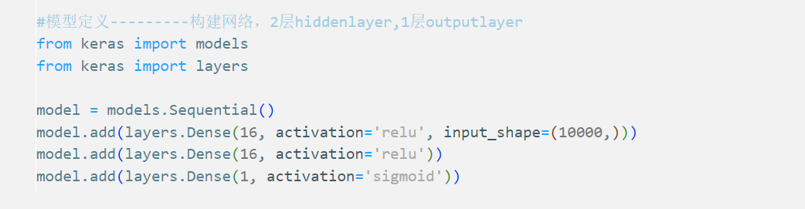

# 神经网络&keras 入门(代码实战)

## 案例一：IMDB 二分类问题

> 有一些地方需要注意
>
> > 1.原始数据需要转变为张量后才能输入网络
> >
> > 2.Dense 全连接层(使用"relu"作为激活函数),会很常用,比如情感识别
> >
> > 3.考虑使用 sigmoid 作为输出,例如：
> > 
> > 当然要搭配 binary_crossentropy 损失函数
> >
> > 4.rmsprops 优化器是一个不错的选择
> >
> > 5.需要对模型的优化过程进行监督，以防止迭代次数过多而导致的过拟合

## 案例二：手写数字识别

> 该问题显然是一个多分类问题,输出为目标图像分别为 10 个数字的概率
>
> > 1.对 N 个类别的数据点进行分类,网络最后一层应该是大小为 N 的 Dense 层
> >
> > 2.中间层的 neuron 数目最好比 10 大
> >
> > 3.对于多分类问题,且 one-hot 的编码输入,使用 categorical_crossentropy 作为损失函数会好一些
> >
> > 4.多分类问题可使用 softmax 作为 outputlayer 的激活函数,可以保证 prediction 之和为 1
